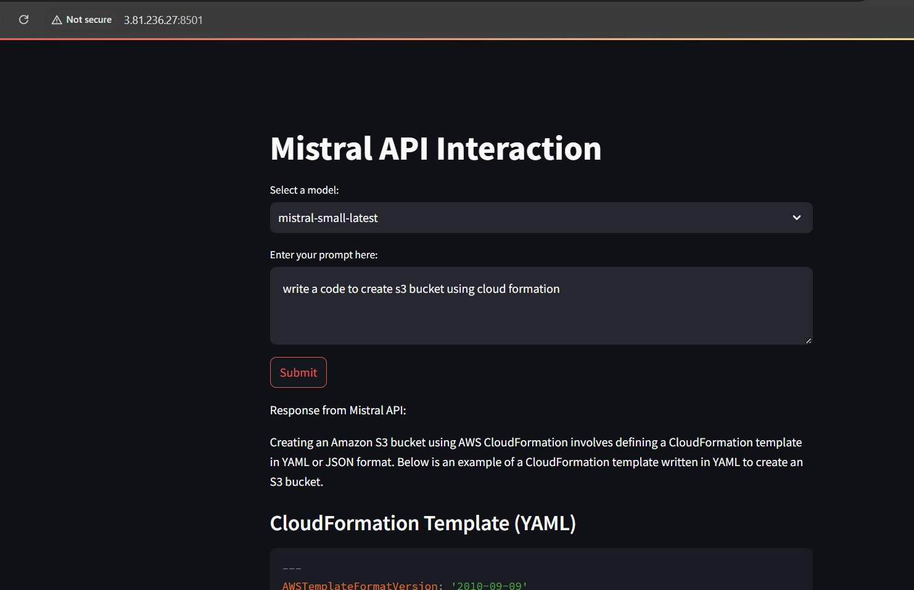

# Overview
This script is a Streamlit application that uses the Mistral API to generate AI-based responses. The application allows users to input prompts and receive AI-generated responses.

## Prerequisites
- **Python**: This application is written in Python. You need to have Python installed on your system.
- **Mistral API**:  This application uses the Mistral API. To utilize this application, you must possess a Mistral API key. Please be aware of the associated costs before using or deploying any services.

## Installation
To install and run this application, follow the steps below:

1. Install the dependencies

`pip install streamlit requests`

2. Clone the repository or copy the main.py file
Note: Please modify the **code** to suit your specific needs. Clearly specify the **Mistral API** endpoint and **API Key** that you intend to employ.

3. Set up Mistral API credentials

This application requires Mistral API credentials to access the Mistral API. Make sure to configure your Mistral API key by setting it in the code:

`MISTRAL_API_ENDPOINT = "https://api.mistral.ai/v1/chat/completions"`
`MISTRAL_API_KEY = "your_mistral_api_key"'

4. Run the application

You can start the application by running:
`streamlit run app.py`

## Usage
To use this application, run the script, navigate to the displayed URL in a web browser, enter a query in the text input, and click 'Submit'. The AI-generated response will be displayed below the 'Submit' button.

### The webpage will appear as shown below. 

