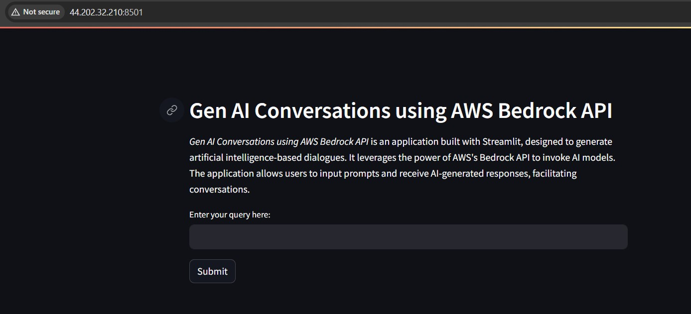
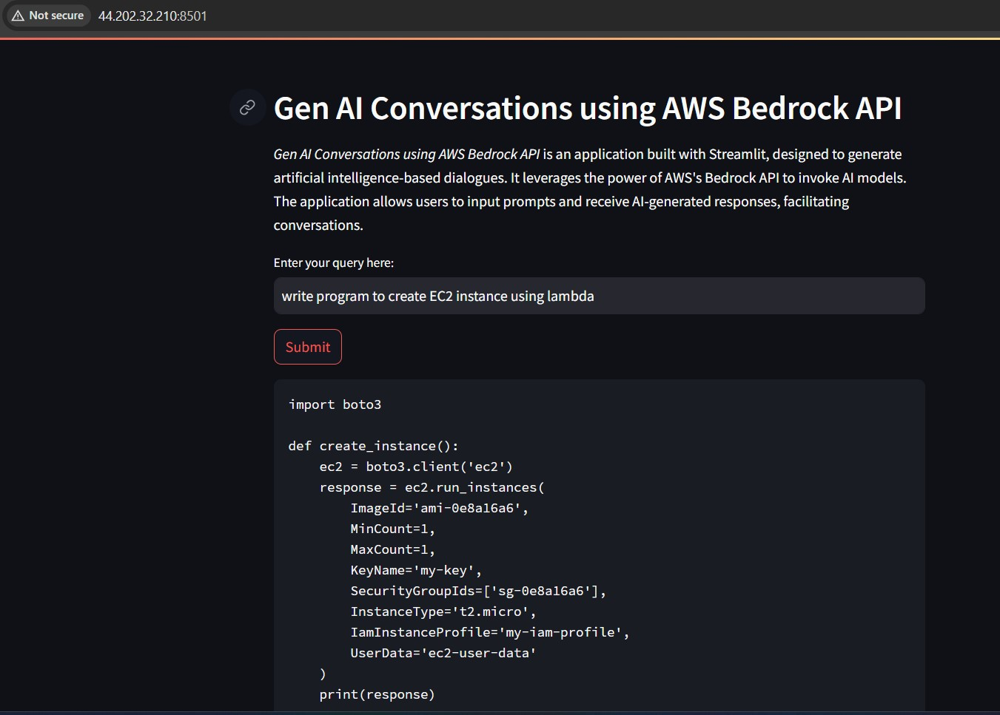

# Overview
This script is a Streamlit application that uses the AWS Bedrock API to generate AI-based dialogues. The application allows users to input prompts and receive AI-generated responses, facilitating conversations.

## Prerequisites
- **Python**: This application is written in Python. You need to have Python installed on your system.
- **AWS Account**: This application uses **AWS Bedrock API**.  To utilize this application, you must possess an AWS account and engage with services such as **EC2**, **IAM**, and **AWS Bedrock** among others. Please be aware of the associated costs before using or deploying any services. Ensure to terminate all services after completion to avoid unnecessary charges.

## Installation
To install and run this application, follow the steps below:

1. Install the dependencies

`pip install streamlit boto3`

2. Clone the repository or copy the main.py file

Note : Please modify the **code** to suit your specific needs. The application now uses the **anthropic.claude-3-sonnet-20240229-v1:0** model (Claude 3 Sonnet). Ensure your AWS Bedrock region supports this model. Remember to update the region name in `main.py` if necessary.

3. Set up AWS credentials

This application requires AWS credentials to access the Bedrock API. Make sure to configure your AWS credentials by running:

`aws configure`

You will be prompted to provide your AWS Access Key ID, Secret Access Key, default region name, and default output format.

4. Run the application

You can start the application by running:
`streamlit run main.py`

## Usage
To use this application, run the script, navigate to the displayed URL in a web browser, enter a query in the text input, and click 'Submit'. The AI-generated response will be displayed below the 'Submit' button.

### The webpage will appear as shown below. 

### Gave the prompt as "Write program to create an EC2 instance using lambda" and below is the response i received (Please note: Your domain or IP address will differ from the example provided.)

