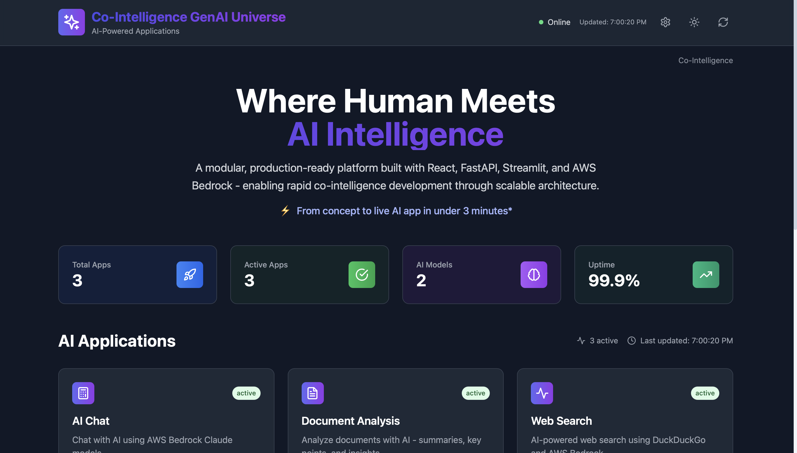
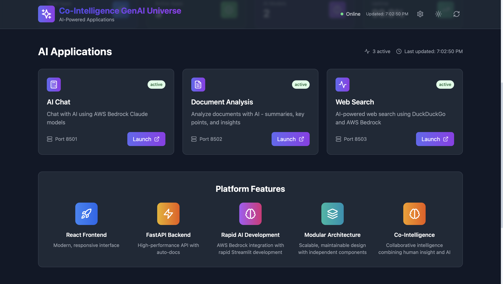
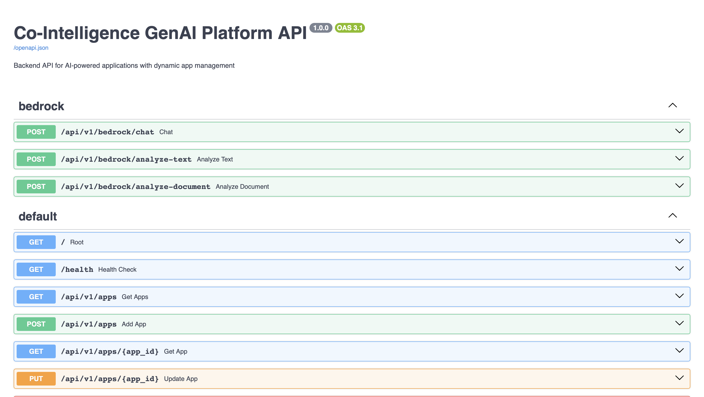
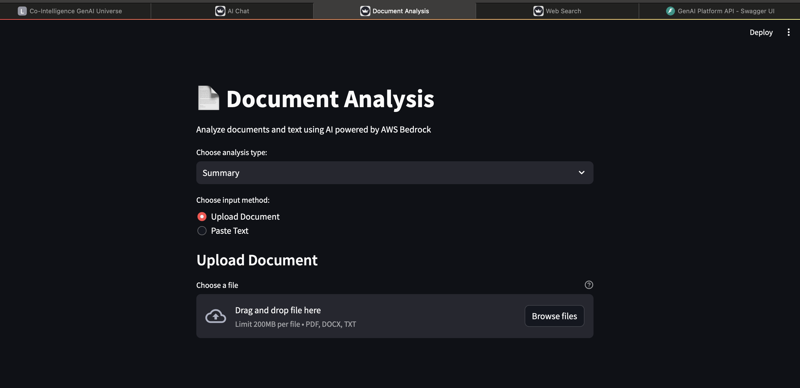

# 🚀 Co-Intelligence GenAI Universe


**Where Human Meets AI Intelligence - Now with Cloud Deployment Support**

A modular, production-ready platform built with React, FastAPI, Streamlit, and AWS Bedrock - enabling rapid co-intelligence development through scalable architecture that works seamlessly in both local and cloud environments.

⚡ **From concept to live AI app in under 3 minutes - anywhere***

## 🎯 Platform Features

- **🚀 React Frontend** - Modern, responsive interface with dark/light themes
- **⚡ FastAPI Backend** - High-performance API with auto-docs
- **🧠 Rapid AI Development** - AWS Bedrock integration with rapid Streamlit development
- **🏗️ Modular Architecture** - Scalable, maintainable design with independent components
- **🤖 Co-Intelligence** - Collaborative intelligence combining human insight and AI
- **🌍 Environment-Aware** - Seamless deployment on local machines and cloud (EC2)
- **🔄 Auto-Configuration** - Smart environment detection and URL management

## 📸 Platform Screenshots

### Main Dashboard

*Modern React frontend with real-time system metrics, app status monitoring, and dark theme interface*

### Application Overview

*Complete view of available AI applications with launch capabilities and platform features showcase*

### API Documentation

*Interactive Swagger UI showing all available API endpoints for Bedrock AI services and system management*

### Document Analysis App

*Streamlit-based document analysis interface with drag-and-drop file upload and multiple analysis options*

## 🏗️ Architecture

```
┌─────────────────┐    Launch App    ┌──────────────────┐
│   React         │ ──────────────► │   Streamlit      │
│   Landing Page  │                 │   AI Apps        │
│   (Port 3000)   │                 │   (Port 8501+)   │
└─────────────────┘                 └──────────────────┘
         │                                    │
         │ HTTP/REST                          │
         ▼                                    │
┌──────────────────┐                         │
│   FastAPI        │ ◄───────────────────────┘
│   Backend        │
│   (Port 8000)    │
└──────────────────┘
         │
         ▼
┌──────────────────┐
│   AWS Bedrock    │
│   Converse API   │
└──────────────────┘
```

## 🌍 Deployment Environments

### 🏠 Local Development
- **Perfect for:** Development, testing, and local demos
- **Access:** http://localhost:3000
- **Configuration:** Automatic localhost detection
- **Features:** Hot reload, debug mode, development tools

### ☁️ Cloud Deployment (EC2)
- **Perfect for:** Production, sharing, and scalable deployment
- **Access:** http://YOUR_EC2_PUBLIC_IP:3000
- **Configuration:** Automatic cloud detection and IP configuration
- **Features:** Production optimization, auto-restart, security headers

## 📱 Available Apps

### 🤖 AI Chat
- **AI-powered chat** using AWS Bedrock Claude 3 Haiku models
- **Real-time responses** with conversation history
- **Environment-aware interface** with connectivity testing
- **Status**: ✅ **Working** - Tested with AWS Bedrock
- **Access**: 
  - Local: http://localhost:8501
  - Cloud: http://YOUR_EC2_IP:8501

### 📄 Document Analysis
- **Document upload** support (PDF, DOCX, TXT)
- **AI-powered text analysis** with multiple options:
  - Summary
  - Key Points
  - Important Questions
  - Detailed Analysis
- **Environment-aware processing** with backend connectivity tests
- **Status**: ✅ **Working** - Ready for document processing
- **Access**: 
  - Local: http://localhost:8502
  - Cloud: http://YOUR_EC2_IP:8502

### 🔍 Web Search
- **AI-powered web search** using DuckDuckGo and AWS Bedrock
- **Intelligent rate limiting** with automatic retry logic
- **AI analysis** of search results for comprehensive insights
- **Environment-aware configuration** with smart URL handling
- **Status**: ✅ **Working** - Enhanced with rate limit handling
- **Access**: 
  - Local: http://localhost:8503
  - Cloud: http://YOUR_EC2_IP:8503

## 🚀 Quick Start

### Prerequisites
- Docker & Docker Compose
- AWS credentials (for AI features)
- For EC2: Security Group with ports 3000, 8000, 8501-8503 open

### Environment Setup

#### Unified Environment Configuration:
The platform uses a single `.env` file that works for both local and cloud deployments.

```bash
# Edit the .env file
nano .env

# 1. Add your AWS credentials:
AWS_ACCESS_KEY_ID=your_access_key_here
AWS_SECRET_ACCESS_KEY=your_secret_key_here

# 2. Set PUBLIC_IP based on your deployment:
# For Local Development: PUBLIC_IP=localhost
# For Cloud/EC2 Deployment: PUBLIC_IP=your_ec2_public_ip
```

### Deployment (Choose Your Method)

Both deployment methods work with the same unified `.env` file:

#### Method 1: Using Deploy Script (Recommended)
**Features**: Environment detection, health checks, detailed logging, automatic validation

##### Local Development:
```bash
# 1. Set environment for local
# In .env file: PUBLIC_IP=localhost

# 2. Deploy using script
./scripts/deploy.sh

# 3. Access applications
# Frontend: http://localhost:3000
# AI Chat: http://localhost:8501
# Document Analysis: http://localhost:8502
# Web Search: http://localhost:8503
# Backend API: http://localhost:8000
# API Docs: http://localhost:8000/docs
```

##### Cloud/EC2 Deployment:
```bash
# 1. Set environment for cloud
# In .env file: PUBLIC_IP=your_ec2_public_ip

# 2. Deploy using script
./scripts/deploy.sh

# 3. Access applications
# Frontend: http://your_ec2_ip:3000
# AI Chat: http://your_ec2_ip:8501
# Document Analysis: http://your_ec2_ip:8502
# Web Search: http://your_ec2_ip:8503
# Backend API: http://your_ec2_ip:8000
# API Docs: http://your_ec2_ip:8000/docs
```

#### Method 2: Direct Docker Compose Commands
**Features**: Faster execution, standard Docker workflow, direct control

##### Local Development:
```bash
# 1. Set environment for local
# In .env file: PUBLIC_IP=localhost

# 2. Deploy directly
docker-compose up -d --build

# 3. Access applications (same URLs as Method 1)
```

##### Cloud/EC2 Deployment:
```bash
# 1. Set environment for cloud
# In .env file: PUBLIC_IP=your_ec2_public_ip

# 2. Deploy directly
docker-compose -f docker-compose.prod.yml up -d --build

# 3. Access applications (same URLs as Method 1)
```

### Management Commands

#### Using Deploy Script:
```bash
# Deploy (works for both local and cloud based on .env setting)
./scripts/deploy.sh

# View comprehensive system status
./scripts/test-system.sh
```

#### Using Direct Docker Compose:

##### View Logs:
```bash
# Local
docker-compose logs -f

# Cloud
docker-compose -f docker-compose.prod.yml logs -f
```

##### Stop Services:
```bash
# Local
docker-compose down

# Cloud
docker-compose -f docker-compose.prod.yml down
```

##### Restart Services:
```bash
# Local
docker-compose restart

# Cloud
docker-compose -f docker-compose.prod.yml restart
```

## 🛠️ Development

### Project Structure
```
allapps/
├── backend/                 # FastAPI backend with environment awareness
│   ├── app/
│   │   ├── api/v1/         # API endpoints
│   │   ├── services/       # Business logic (Bedrock service)
│   │   └── main.py         # Environment-aware FastAPI app
├── react-frontend/         # React landing page with dynamic configuration
├── apps/                   # Environment-aware Streamlit applications
│   ├── ai_chat.py         # AI Chat app with environment detection
│   ├── document_analysis.py # Document analysis with cloud support
│   └── web_search.py      # Web Search with environment awareness
├── config/                # Configuration management
│   └── apps.json          # Dynamic app registry with environment support
├── scripts/               # Enhanced automation scripts
│   ├── deploy.sh          # Smart environment-aware deployment
│   ├── add-app.py         # Environment-aware app creation
│   ├── validate-setup.sh  # Comprehensive validation for both environments
│   └── test-system.sh     # Environment-aware system testing
├── docker-compose.yml     # Development container orchestration
├── docker-compose.prod.yml # Production container orchestration
├── .env.local            # Local development configuration
├── .env.cloud            # Cloud deployment configuration
└── .env.example          # Environment template
```

## ➕ Adding New Apps

### Automated App Creation (Recommended)
```bash
# Create environment-aware apps with full integration
./scripts/add-app.py "Weather App" "Weather forecasting with AI" --category utility

# The new app will automatically include:
# - Environment detection (local/cloud)
# - Dynamic URL configuration
# - Backend connectivity testing
# - Environment-specific features
```

### What Gets Created Automatically:
- ✅ Complete Streamlit app template with environment awareness
- ✅ Docker service configuration for both local and cloud
- ✅ Apps.json configuration update with environment support
- ✅ Health checks and networking for both environments
- ✅ Automatic port assignment
- ✅ React frontend integration with dynamic URLs

## 🎨 Enhanced Frontend Features

### 🌙 Dark/Light Mode
- **Theme Toggle** - Switch between dark and light themes
- **Persistent Preferences** - Theme choice saved automatically
- **Smooth Transitions** - All UI elements adapt seamlessly

### 📊 Real-time Dashboard
- **Auto-refresh** - Updates every 30 seconds
- **Live Status** - System health monitoring with environment info
- **Performance Metrics** - App usage and uptime tracking
- **Environment Display** - Shows current deployment environment

### ⚙️ Management Panel
- **Analytics** - Usage patterns and performance insights
- **Environment Info** - Current deployment status and configuration
- **Backup** - Configuration management tools
- **Security** - Access monitoring and logs

## 🔧 API Endpoints

### Environment Configuration
- `GET /api/v1/config` - Get environment configuration and URLs
- `GET /health` - Health check with environment details

### Bedrock AI Services
- `POST /api/v1/bedrock/chat` - AI chat with conversation history
- `POST /api/v1/bedrock/analyze-text` - Analyze text content
- `POST /api/v1/bedrock/analyze-document` - Analyze uploaded documents

### System Management
- `GET /api/v1/apps` - Get available apps list (environment-aware URLs)
- `POST /api/v1/apps` - Add new app configuration
- `GET /api/v1/system/stats` - System statistics with environment info

### Documentation
- `GET /docs` - Interactive API documentation
- `GET /redoc` - Alternative API documentation

## 🌍 Cloud Deployment Guide

### EC2 Setup
1. **Launch EC2 Instance** (Ubuntu 20.04+ recommended)
2. **Configure Security Group:**
   ```
   Port 22   (SSH)          - Your IP
   Port 3000 (Frontend)     - 0.0.0.0/0
   Port 8000 (Backend API)  - 0.0.0.0/0
   Port 8501 (AI Chat)      - 0.0.0.0/0
   Port 8502 (Doc Analysis) - 0.0.0.0/0
   Port 8503 (Web Search)   - 0.0.0.0/0
   ```

3. **Install Dependencies:**
   ```bash
   # Update system
   sudo apt update && sudo apt upgrade -y
   
   # Install Docker
   curl -fsSL https://get.docker.com -o get-docker.sh
   sudo sh get-docker.sh
   sudo usermod -aG docker $USER
   
   # Install Docker Compose
   sudo curl -L "https://github.com/docker/compose/releases/download/v2.20.0/docker-compose-$(uname -s)-$(uname -m)" -o /usr/local/bin/docker-compose
   sudo chmod +x /usr/local/bin/docker-compose
   
   # Logout and login again for Docker group changes
   ```

4. **Deploy Application:**
   ```bash
   # Clone your repository
   git clone <your-repo-url>
   cd allapps
   
   # Setup environment
   cp .env.cloud .env
   # Edit .env with your AWS credentials and EC2 public IP
   
   # Deploy (automatic environment detection)
   ./scripts/deploy.sh
   ```

### Environment Variables for Cloud
```bash
# Cloud-specific configuration
DEPLOYMENT_ENV=cloud
HOST_IP=0.0.0.0
PUBLIC_IP=your-ec2-public-ip
ENVIRONMENT=production
DEBUG=false

# AWS Configuration
AWS_DEFAULT_REGION=us-east-1
AWS_ACCESS_KEY_ID=your_access_key
AWS_SECRET_ACCESS_KEY=your_secret_key

# Dynamic URLs (automatically configured)
REACT_APP_API_URL=http://your-ec2-public-ip:8000/api/v1
REACT_APP_AI_CHAT_URL=http://your-ec2-public-ip:8501
# ... etc
```

## 📊 Platform Benefits

- **🏗️ Modular Architecture** - Independent, scalable components
- **⚡ Rapid Development** - New AI apps in under 3 minutes
- **🤖 Co-Intelligence** - Human-AI collaborative experiences
- **🐳 Container-Based** - Docker orchestration with health checks
- **📈 Auto-Scaling** - Independent service scaling
- **🎨 Modern UI** - Professional React interface with themes
- **🔧 Developer Friendly** - Hot reload, comprehensive tooling
- **🌍 Environment Agnostic** - Works seamlessly local and cloud
- **🔄 Auto-Configuration** - Smart environment detection
- **🛡️ Production Ready** - Security headers, error handling, monitoring

## 🛠️ Troubleshooting

### Common Issues

#### Environment Configuration
```bash
# Check current environment variables
cat .env | grep PUBLIC_IP

# Verify Docker containers are running
docker ps

# Check container logs
docker-compose logs -f  # Local
docker-compose -f docker-compose.prod.yml logs -f  # Cloud
```

#### Browser Cache (Most Common)
If changes don't appear after updates:
```bash
# Hard refresh in browser
# Chrome/Edge: Ctrl+Shift+R (Windows) or Cmd+Shift+R (Mac)
# Firefox: Ctrl+F5 (Windows) or Cmd+Shift+R (Mac)
# Safari: Cmd+Option+R (Mac)

# Or use incognito/private mode
```

#### Docker Issues
```bash
# Reset Docker environment
docker-compose down --volumes --remove-orphans  # Local
docker-compose -f docker-compose.prod.yml down --volumes --remove-orphans  # Cloud

# Rebuild from scratch
docker system prune -f
docker-compose up -d --build  # Local
docker-compose -f docker-compose.prod.yml up -d --build  # Cloud
```

#### Port Conflicts
```bash
# Check port usage
lsof -i :3000 -i :8000 -i :8501 -i :8502 -i :8503

# Kill processes if needed
sudo kill -9 $(lsof -t -i:3000)
```

#### AWS Credentials
```bash
# Verify AWS credentials
aws sts get-caller-identity

# Or check .env file
cat .env | grep AWS

# Test AI functionality directly
curl -X POST http://localhost:8000/api/v1/bedrock/chat \
  -H "Content-Type: application/json" \
  -d '{"message": "Hello, test message"}'
```

#### Cloud Access Issues
```bash
# Check EC2 Security Group settings
# Ensure ports 3000, 8000, 8501-8503 are open to 0.0.0.0/0

# Check if services are running
curl http://YOUR_EC2_IP:8000/health

# Check environment configuration
curl http://YOUR_EC2_IP:8000/api/v1/config
```

## 📄 License

MIT License - see LICENSE file for details

---

**Built with ❤️ using React, FastAPI, Streamlit & AWS Bedrock**

## 🎉 Quick Commands Summary

```bash
# 🔍 Check environment configuration
cat .env | grep PUBLIC_IP

# 🚀 Deploy locally (Choose one method)
# Method 1: Using deploy script
./scripts/deploy.sh
# Method 2: Direct Docker Compose
docker-compose up -d --build

# 🚀 Deploy on cloud (Choose one method)
# Method 1: Using deploy script
./scripts/deploy.sh
# Method 2: Direct Docker Compose
docker-compose -f docker-compose.prod.yml up -d --build

# 📊 View logs
docker-compose logs -f                                    # Local
docker-compose -f docker-compose.prod.yml logs -f        # Cloud

# 🔄 Restart services
docker-compose restart                                    # Local
docker-compose -f docker-compose.prod.yml restart        # Cloud

# 🛑 Stop everything
docker-compose down                                       # Local
docker-compose -f docker-compose.prod.yml down           # Cloud

# 🌍 Check environment
curl http://localhost:8000/api/v1/config                 # Local
curl http://YOUR_EC2_IP:8000/api/v1/config              # Cloud

# 🧪 Test system (using deploy script features)
./scripts/test-system.sh
```

## 🌟 New in Version 2.0

- ✅ **Unified Environment Configuration** - Single .env file for both local and cloud
- ✅ **Simple Deployment Commands** - Direct Docker Compose commands
- ✅ **Variable-Based URLs** - All URLs use PUBLIC_IP variable for easy switching
- ✅ **Enhanced Frontend** - Environment-aware React application
- ✅ **Cloud-Ready Apps** - All Streamlit apps support cloud deployment
- ✅ **Production Optimization** - Separate configurations for dev/prod
- ✅ **Simplified Workflow** - Just change PUBLIC_IP and deploy
- ✅ **Enhanced Monitoring** - Environment-specific health checks and metrics
