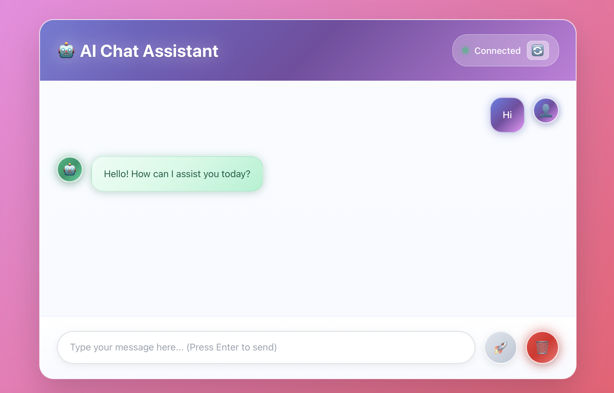
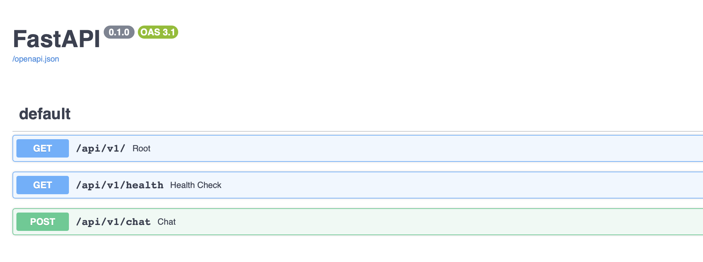

# ✨ AI Chat Assistant - FastAPI + React + AWS Bedrock

A **stunning, modern chat application** with an animated React frontend that communicates with a FastAPI backend, powered by AWS Bedrock for AI responses. Features beautiful floating particles, dynamic gradients, and smooth animations.

## 🎯 **Live Demo**
- **🎨 Chat Application**: http://localhost:3001
- **🔧 API Backend**: http://localhost:8000
- **📚 API Documentation**: http://localhost:8000/docs

## 🎥 **Demo Video & Screenshots**

### 🎬 **Live Demo Video**
https://github.com/user-attachments/assets/0.mov
*Watch the AI Chat Assistant in action with beautiful animations and real-time responses*

### 🎨 **Beautiful Chat Interface**

*Main chat interface with animated floating particles and gradient backgrounds*

### 🔧 **FastAPI Swagger UI Documentation**

*Interactive API documentation with FastAPI's built-in Swagger UI interface*

## 📁 **Project Structure**

```
FastapiReact/
├── 📄 README.md                    # Project documentation
├── 📄 .env                        # AWS credentials & configuration
├── 📄 .gitignore                  # Git ignore rules
├── 📄 .dockerignore               # Docker ignore rules
├── 📄 docker-compose.yml          # Docker orchestration
│
├── 📸 screenshots/                # Application screenshots & demo video
│   ├── 📄 0.mov                   # Live demo video
│   ├── 📄 1.png                   # Main chat interface screenshot
│   └── 📄 2.png                   # FastAPI Swagger UI screenshot
│
├── 🔧 backend/                    # FastAPI Backend
│   ├── 📄 app.py                  # Main FastAPI application (3.5KB)
│   ├── 📄 requirements.txt        # Python dependencies
│   └── 📄 Dockerfile             # Backend container setup
│
├── 🎨 frontend/                   # React Frontend
│   ├── 📁 public/
│   │   └── 📄 index.html          # HTML template
│   │
│   ├── 📁 src/
│   │   ├── 📄 App.js              # Main React component (6.3KB)
│   │   ├── 📄 App.css             # Rich styling with animations (17KB)
│   │   ├── 📄 index.js            # React entry point
│   │   ├── 📄 index.css           # Global animated background
│   │   ├── 📄 FloatingParticles.js # Particle animation component
│   │   └── 📄 FloatingParticles.css # Particle styling (2.1KB)
│   │
│   ├── 📄 package.json            # Node.js dependencies
│   ├── 📄 nginx.conf              # Nginx configuration
│   └── 📄 Dockerfile             # Multi-stage build setup
```

## ✨ **Stunning Visual Features**

### 🌟 **Animated Background**
- **15 floating particles** with different sizes and colors
- **Dynamic gradient backgrounds** that shift through 5+ colors
- **Smooth particle movement** with rotation and drift effects
- **Glowing particle effects** with colorful shadows

### 🎨 **Rich UI Elements**
- **Animated gradient themes** throughout the interface
- **Glowing message bubbles** with hover shimmer effects
- **Pulsing interactive buttons** with ripple animations
- **Smooth slide-in animations** for messages
- **Color-coded avatars** with glow effects
- **Bouncing typing indicators** with enhanced animations

### 🌈 **Color System**
- **5-color gradient palette**: Blue → Purple → Pink → Red → Cyan
- **Dynamic color transitions** that flow continuously
- **Glowing accents** on all interactive elements
- **Enhanced contrast** for perfect readability

## 🚀 **Core Features**

### 💬 **Chat Functionality**
- **Real-time AI chat** with AWS Bedrock (Claude)
- **Instant responses** with typing indicators
- **Message history** with smooth animations
- **Error handling** with user-friendly messages
- **Auto-scroll** to latest messages

### 🔧 **Backend Features**
- **Versioned API endpoints** (v1)
- **Health monitoring** with AWS connection status
- **CORS support** for cross-origin requests
- **Timeout management** and error handling
- **Production-ready** FastAPI server

### 📱 **User Experience**
- **Responsive design** for all devices
- **Keyboard shortcuts** (Enter to send)
- **Visual feedback** for all interactions
- **Loading states** with beautiful animations
- **Professional typography** and spacing

## 🔌 **API Endpoints**

| Method | Endpoint | Description |
|--------|----------|-------------|
| `GET` | `/api/v1/` | API status check |
| `GET` | `/api/v1/health` | Health check + AWS Bedrock connection |
| `POST` | `/api/v1/chat` | Main chat endpoint |

## 🚀 **Quick Start**

### 1. **Configure AWS Credentials**
Edit `.env` file with your AWS credentials:
```bash
AWS_ACCESS_KEY_ID=your_access_key_here
AWS_SECRET_ACCESS_KEY=your_secret_key_here
AWS_REGION=us-east-1
BEDROCK_MODEL_ID=anthropic.claude-3-haiku-20240307-v1:0
```

### 2. **Launch the Application**
```bash
docker-compose up --build
```

### 3. **Access the Application**
- **🎨 Beautiful Chat Interface**: http://localhost:3001
- **🔧 API Backend**: http://localhost:8000
- **📊 API Status**: http://localhost:8000/api/v1/
- **❤️ Health Check**: http://localhost:8000/api/v1/health
- **📚 Interactive API Docs**: http://localhost:8000/docs

## 🔄 **How It Works**

### **Connection Flow:**
```
User Input → React Frontend → FastAPI Backend → AWS Bedrock → AI Response → Animated Display
```

1. **User types message** in the beautiful React interface
2. **React sends HTTP POST** to FastAPI at `/api/v1/chat`
3. **FastAPI processes** and calls AWS Bedrock
4. **AWS Bedrock (Claude)** generates AI response
5. **Response flows back** through FastAPI to React
6. **React displays** with smooth animations and effects

### **Code Examples:**

**Frontend (React):**
```javascript
const response = await axios.post(`${BACKEND_URL}/api/v1/chat`, {
  message: userMessage
}, {
  timeout: 30000
});
```

**Backend (FastAPI):**
```python
@v1_router.post("/chat")
async def chat(chat_message: ChatMessage):
    # Calls AWS Bedrock and returns AI response
    return ChatResponse(response=ai_response)
```

## 🧪 **Testing the API**

### **Interactive Testing (Recommended)**
1. Open **http://localhost:8000/docs**
2. Try each endpoint with the "Try it out" feature
3. View real-time responses and status codes

### **Command Line Testing**
```bash
# Test API status
curl http://localhost:8000/api/v1/

# Test health check
curl http://localhost:8000/api/v1/health

# Test chat functionality
curl -X POST http://localhost:8000/api/v1/chat \
  -H "Content-Type: application/json" \
  -d '{"message": "Hello, how are you?"}'
```

## 🏗️ **Architecture**

### **🐳 Container Setup**
```
┌─────────────────┐    ┌─────────────────┐
│   Frontend      │    │    Backend      │
│   (React)       │    │   (FastAPI)     │
│   Port: 3001    │◄──►│   Port: 8000    │
│   Nginx Server  │    │   Python/Uvicorn│
└─────────────────┘    └─────────────────┘
         │                       │
         └───────────────────────┘
                   │
            ┌─────────────┐
            │ AWS Bedrock │
            │   (Claude)  │
            └─────────────┘
```

### **🎨 Frontend (React + Nginx)**
- **Port**: 3001
- **Technology**: React 18 with modern hooks
- **Features**: Animated UI, real-time updates, responsive design
- **Serving**: Nginx with optimized static file delivery
- **Animations**: 20+ CSS animations and effects

### **🔧 Backend (FastAPI)**
- **Port**: 8000
- **Technology**: Python FastAPI with AWS Bedrock
- **Features**: Versioned APIs, health checks, error handling
- **AI Integration**: AWS Bedrock with Claude model
- **Documentation**: Auto-generated OpenAPI/Swagger docs

## 🎨 **Visual Showcase**

### **🌟 What Makes It Beautiful:**
- ✅ **Magical floating particles** drifting across the screen
- ✅ **Dynamic rainbow gradients** that shift and flow
- ✅ **Glowing message bubbles** with smooth hover effects
- ✅ **Pulsing buttons** with ripple animations
- ✅ **Smooth slide-in animations** for every message
- ✅ **Professional color system** with perfect contrast
- ✅ **Responsive design** that works on any device

### **🎭 Animation Details:**
- **Background**: Animated 5-color gradient with particle system
- **Messages**: Slide-in from left/right with scale effects
- **Buttons**: Pulse, glow, and ripple effects on interaction
- **Avatars**: Color-coded with breathing glow animations
- **Typing**: Enhanced bouncing dots with glow effects
- **Containers**: Subtle glow that shifts between colors

## 🛠️ **Development**

### **Local Development**
```bash
# Backend development
cd backend
pip install -r requirements.txt
uvicorn app:app --reload --port 8000

# Frontend development
cd frontend
npm install
npm start  # Development server on port 3000
```

### **Adding Features**
- **Backend**: Modify `backend/app.py` for new endpoints
- **Frontend**: Update React components in `frontend/src/`
- **Styling**: Enhance animations in `frontend/src/App.css`
- **Particles**: Customize effects in `FloatingParticles.js`

## 🔧 **Troubleshooting**

### **🔌 Connection Issues**
```bash
# Check container status
docker-compose ps

# View logs
docker-compose logs backend
docker-compose logs frontend

# Test API directly
curl http://localhost:8000/api/v1/health
```

### **☁️ AWS Issues**
- Verify credentials in `.env` file
- Check Bedrock model access in AWS Console
- Ensure your region supports Bedrock
- Monitor AWS costs and usage limits

### **🎨 UI Issues**
- Clear browser cache and refresh
- Check browser console for errors
- Verify port 3001 is accessible
- Try different browser or incognito mode

## 📊 **Technical Specifications**

### **Performance**
- **Frontend Build**: Multi-stage Docker optimization
- **Backend**: Async FastAPI with connection pooling
- **Animations**: Hardware-accelerated CSS transforms
- **Serving**: Nginx with gzip compression

### **Security**
- **CORS**: Properly configured for cross-origin requests
- **Environment**: Secure credential management
- **Validation**: Input validation and sanitization
- **Error Handling**: Graceful error responses

### **Scalability**
- **Containerized**: Easy horizontal scaling
- **Stateless**: No server-side session storage
- **API Versioning**: Future-proof endpoint structure
- **Modular**: Clean separation of concerns


