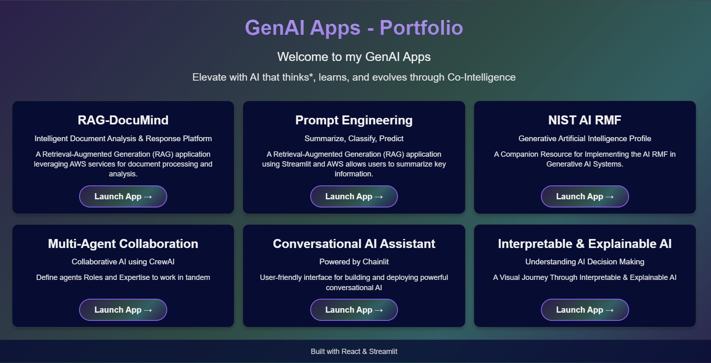
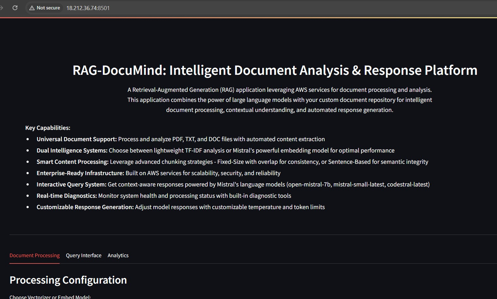
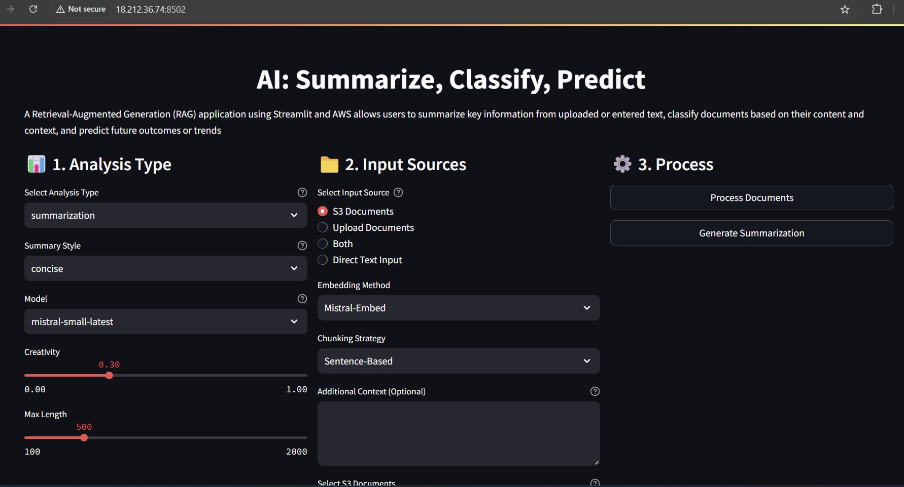
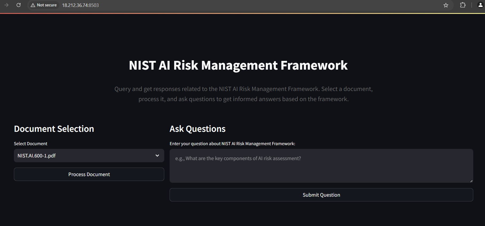
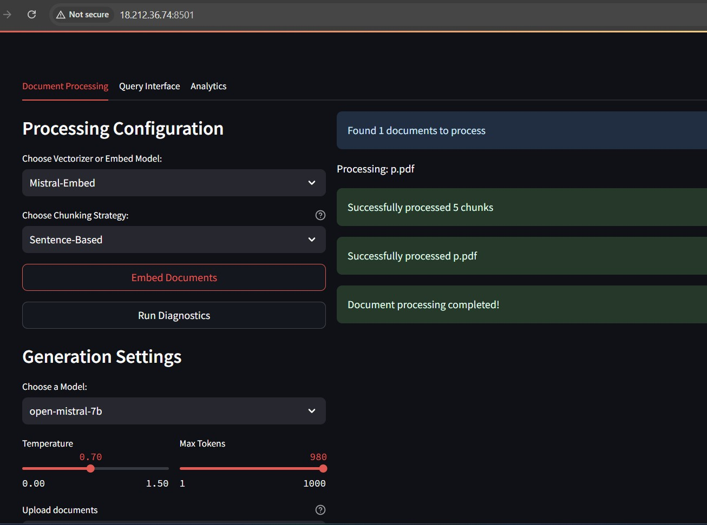
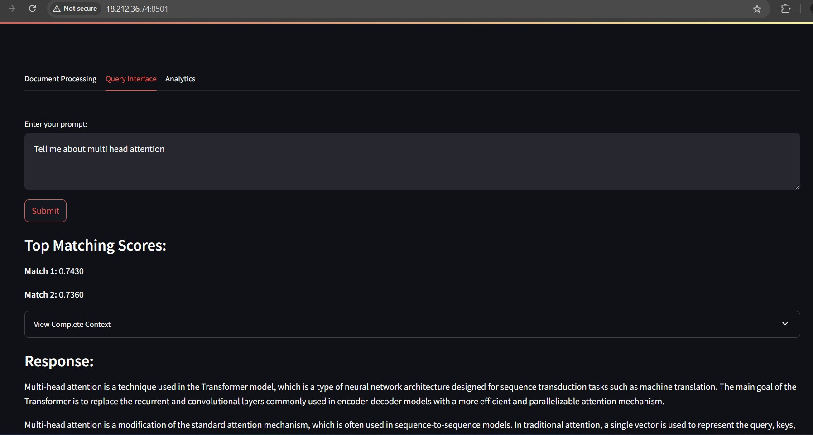
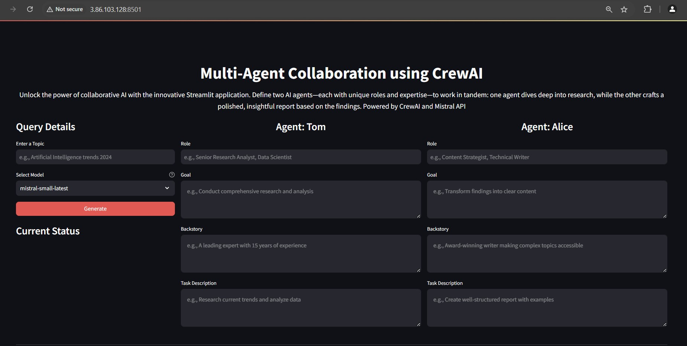

# GenAI Apps - Portfolio
## Welcome to my GenAI Apps

Supports various document types, offers lightweight TF-IDF or Mistral's embedding for analysis, uses advanced chunking strategies, runs on AWS for reliability, provides context-aware responses, and includes customizable temperature and token limits along with real-time diagnostics

## Key Features
- **Universal Document Support**: Process and analyze PDF, TXT, and DOC/DOCX files with automated content extraction.
- **Dual Intelligence Systems**:
  - Lightweight **TF-IDF** vectorization.
  - **Mistral's embedding model** for advanced contextual understanding.
- **Smart Content Processing**: Choose between:
  - Fixed-size chunking with overlap.
  - Sentence-based chunking for semantic integrity.
- **Enterprise-Ready Infrastructure**: Scalable, secure, and reliable, built on AWS services.
- **Interactive Query System**: Context-aware query responses using Mistral models like `open-mistral-7b` and `mistral-small-latest`.
- **Real-time Diagnostics**: Built-in tools to monitor system health and processing status.
- **Customizable Response Generation**: Adjust model responses with customizable temperature and token limits.


## Installation and Setup

1. Create AWS S3 bucket, IAM Role, Postgres database, EC2 instance and Install Python. Mistral API credentials. Create manually in AWS console or refer to Cloud Formation template. Configure React application. Update public IP in App.js.
   For S3 bucket create three folders namely App1_RAG-DocuMind, App2_PromptEng, and App3_Nist-AI-RMF
2. Clone the repository
3. Install dependencies:
  `pip install -r requirements.txt`
4. Set up environment variables: Create a .env file and populate it with your AWS, PostgreSQL, and Mistral API credentials:
```
S3_BUCKET_NAME="yourBucketName"  # Replace with your actual S3 bucket name
S3_FOLDER_APP1=App1_RAG-DocuMind/
S3_FOLDER_APP2=App2_PromptEng/
S3_FOLDER_APP3=App3_Nist-AI-RMF/
AWS_ACCESS_KEY="<YOUR_ACCESS_KEY_ID>"  # Replace with your AWS access key ID
AWS_SECRET_KEY="<YOUR_SECRET_ACCESS_KEY>"  # Replace with your AWS secret access key
AWS_REGION=us-east-1 #update region
POSTGRES_HOST="your_postgres_host" ex:database-1.bsgfkdhd.us-east-1.rds.amazonaws.com
POSTGRES_PORT=5432
POSTGRES_DB="your_database_name"
POSTGRES_USER="your_database_user"
POSTGRES_PASSWORD="your_database_password"
MISTRAL_API_KEY="<YOUR_MISTRAL_API_KEY>"  # Replace with your Mistral API key

```
## Usage

1. Run the application;
`npm start`
`streamlit run RAG-DocuMind.py
`streamlit run PromptEng.py`
`streamlit run Nist-AI-RMF.py`


2. Open the application in your browser
- **React App**: http://publicIP:3000 
- **Streamlit App RAG-DocuMind**: http://publicIP:8501
- **Streamlit App PromptEng**: http://publicIP:8502
- **Streamlit App Mist-AI-RMF**: http://publicIP:8503


## How it Works:
From React App you can launch other apps or directly go to other Apps. 


### App1 RAG-DocuMind: Intelligent Document Analysis & Response Platform
#### A Retrieval-Augmented Generation (RAG) application leveraging AWS services for document processing and analysis. This application combines the power of large language models with your custom document repository for intelligent document processing, contextual understanding, and automated response generation.

1. Upload PDF, TXT, or DOC files to AWS S3
2. Choose Vectorizer or Embed Model 
3. Choose Chunking Strategy(Fixed-Size or Sentence-Based) and click Embed
4. Run Diagnostics (optional)
5. Choose a Model and set temperature and max tokens 
6. Goto Query Interface - Input Prompt and Get a Response.
7. Generate context-aware responses using Mistral models.

### App2 Prompt Engineering: AI: Summarize, Classify, Predict
#### A Retrieval-Augmented Generation (RAG) application using Streamlit and AWS allows users to summarize key information from uploaded or entered text, classify documents based on their content and context, and predict future outcomes or trends

1. Choose Analysis Type (Summarization, Classification, Prediction), Choose summary type, model 
2. Choose Input Source, Embedding Method and chunking strategy, Give Additional context, choose document  
3. Click Process Documents
4. Click Generate to see Response

### App3 NIST AI Risk Management Framework

#### Query and get responses related to the NIST AI Risk Management Framework. Select a document, process it, and ask questions to get informed answers based on the framework.

1. Select Document and click Process
2. Input a question and get a response

### App4 Multi-Agent Collaboration using CrewAI

#### Unlock the power of collaborative AI with the innovative Streamlit application. Define two AI agents—each with unique roles and expertise—to work in tandem: one agent dives deep into research, while the other crafts a polished, insightful report based on the findings. 

1. Input Topic, Choose Model
2. Define Agents Role, Goal, Backstory and Task Description
3. Click Generate 

## Important Notices

- **Cost Awareness**: Be mindful of AWS resources, Mistral APIs, and other resources consumption and costs before deployment
- **Development Purpose**: Not intended for production or commercial use
- **Security**: Never commit credentials to version control and follow AWS security best practices


## The webpage will appear as shown below. 


### 1. GenAI Apps - Portfolio


### 2. App1 : RAG -DocuMind 



### 3. App2 : Prompt Engineering: Summarize, Classify, Predict



### 4. App3: Nist-AI-RMF 



### 5. App in Action  


### 6. App in Action  


### 7. App4: Multi-AgentCollaboration using CrewAI 


### 8. App5: Conversational AI Assistant using Chainlit


