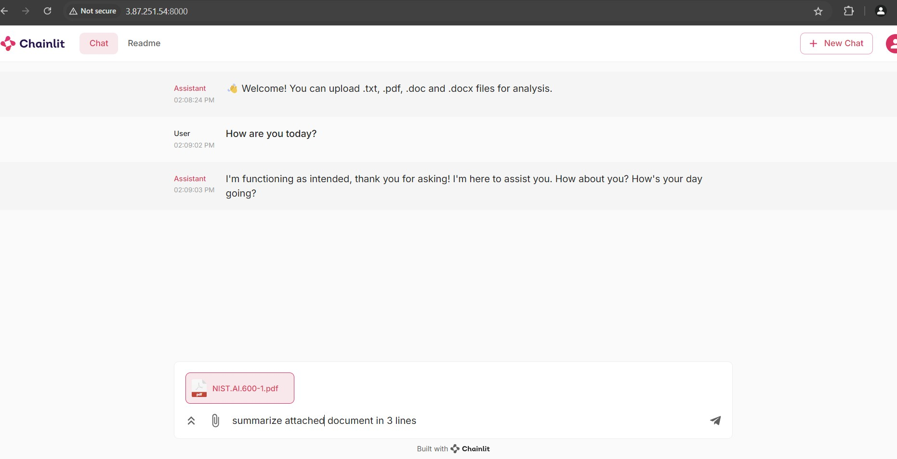
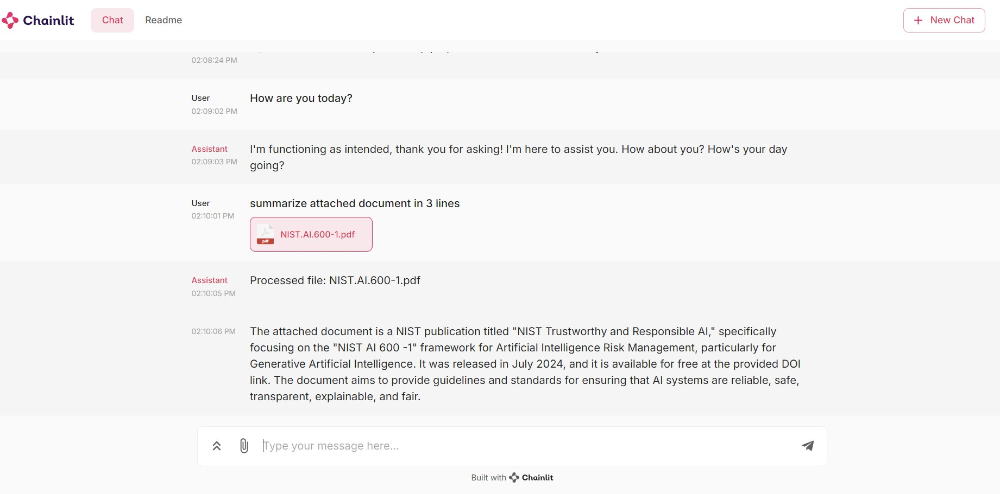
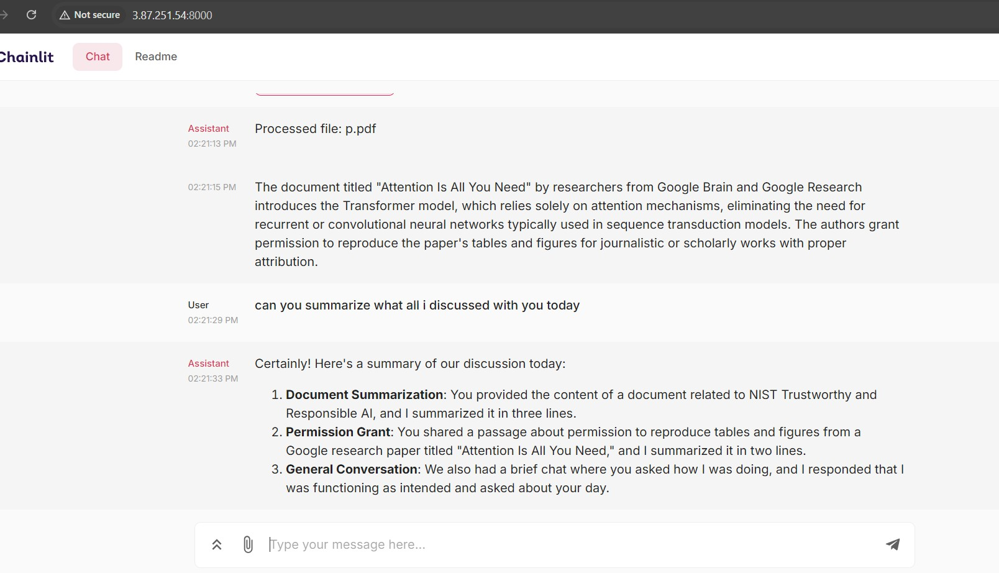

# Conversational AI Assistant Using Chainlit

A powerful AI Assistant powered by Mistral AI and Chainlit. This application provides an interactive assistant that can engage in conversations, analyze documents, and maintain context throughout the interaction.

## Key Features
- Interactive chat interface using Chainlit
- File upload support for multiple formats (.txt, .pdf, .doc, .docx)
- Powered by Mistral AI API for intelligent responses
- Conversation history maintenance
- Async operation for better performance

## Installation and Setup

1. Install Python 3.10 or above
2. Clone the repository
3. Install dependencies:
   ```
   pip install -r requirements.txt
   ```
4. Set up environment variables: Create a .env file and add:
   ```
   MISTRAL_API_KEY="<YOUR_MISTRAL_API_KEY>"
   ```

## Usage

1. Run the application:
   ```
   chainlit run app.py
   ```
2. Access the chat interface in your browser at:
   ```
   http://localhost:8000
   ```

## How it Works

1. Start a conversation with the AI assistant
2. Upload documents for analysis (.txt, .pdf, .doc, .docx)
3. Get intelligent responses based on your messages and uploaded content
4. The application maintains conversation history for context

## Important Notes

- API Usage: Be mindful of Mistral API usage and associated costs
- File Size: Large files may take longer to process
- Security: Never commit your API keys to version control
- Development Status: This is a development version, not intended for production or commercial use

## Technical Details

- Uses async/await for efficient API calls
- Supports multiple file formats
- Implements session management for conversation history
- Maximum response length set to 900 tokens

## Screenshots

### 1. Chat Interface
Initial screen showing the welcome message and an example conversation with the AI assistant.


### 2. Document Analysis
Example of uploading a document and requesting a summary from the AI assistant.


### 3. Conversation Memory
The AI assistant maintains context from previous messages, enabling natural conversation flow.



