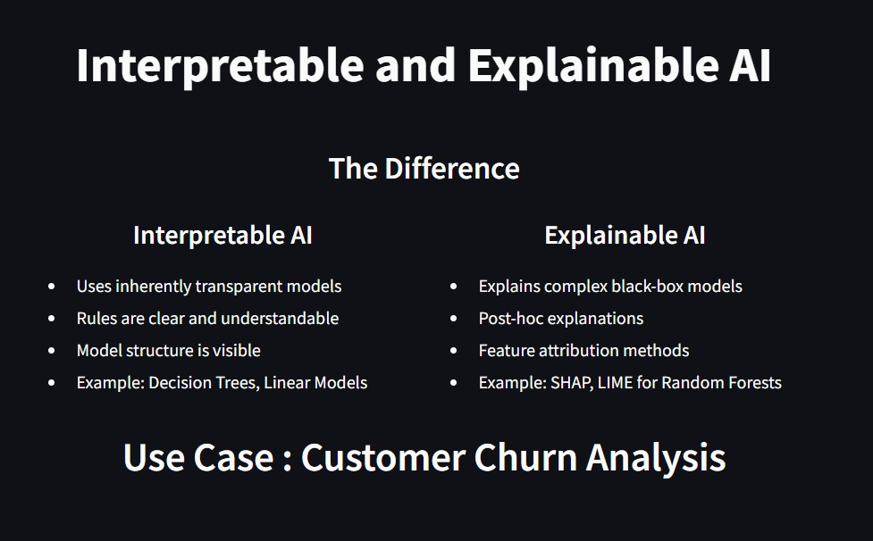
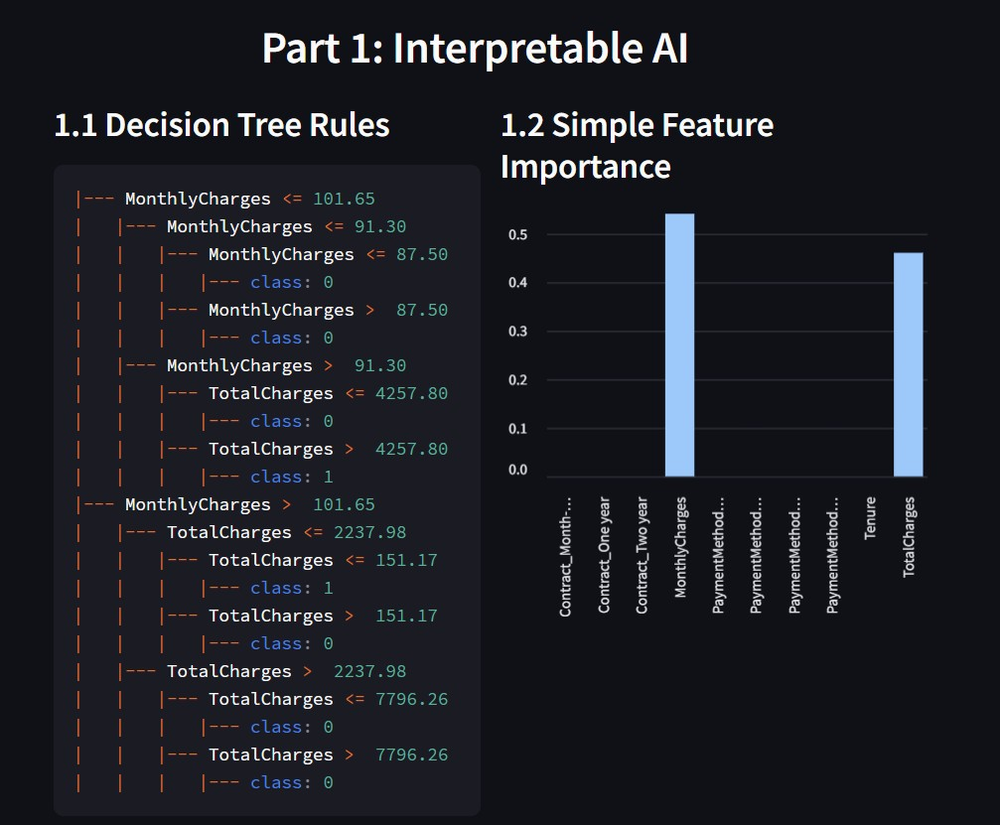
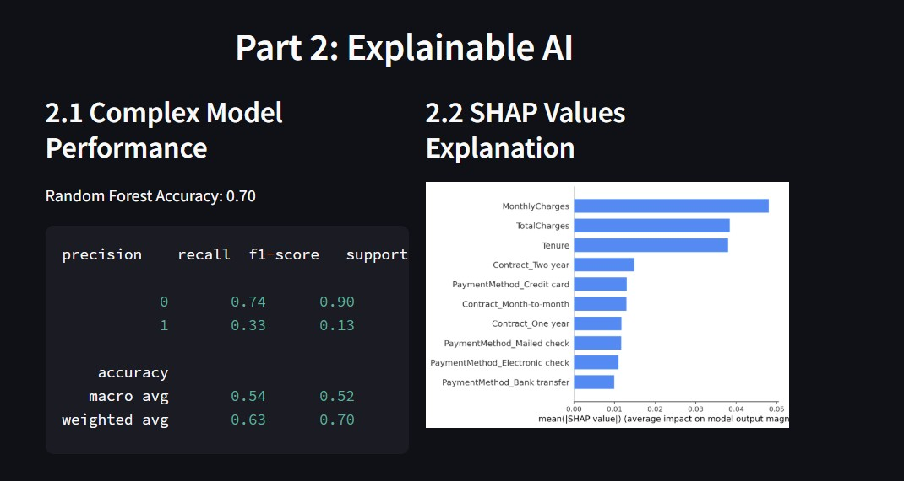
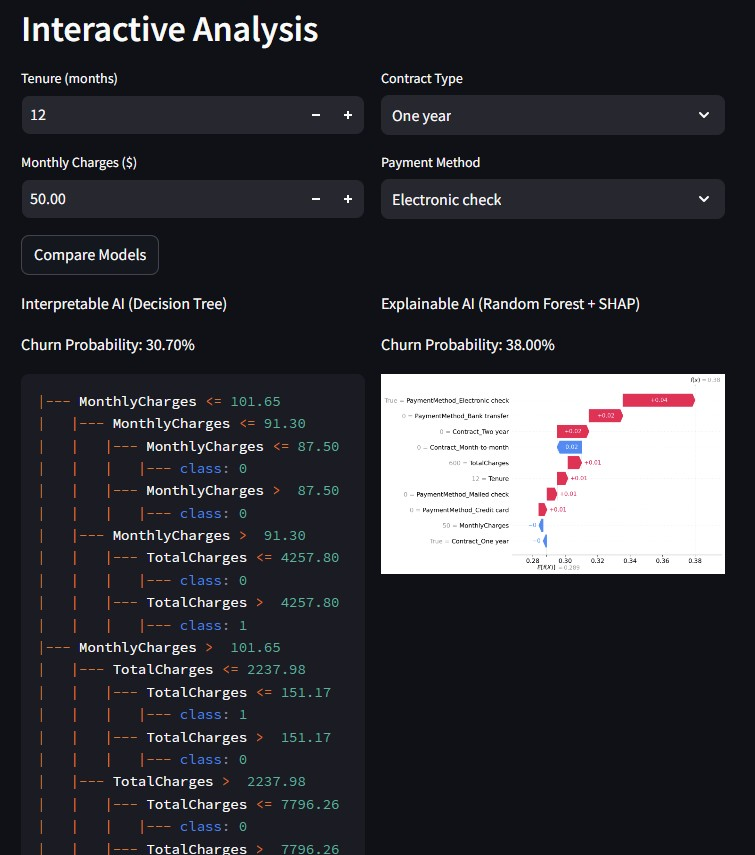

# Interpretable and Explainable AI

An interactive web application demonstrating the differences between Interpretable AI and Explainable AI using customer churn prediction as a use case.

## Key Features
- Interactive comparison of Interpretable AI (Decision Trees) and Explainable AI (Random Forest + SHAP)
- Real-time model predictions and explanations
- Visual representations of model decisions
- Side-by-side comparison of different approaches

## Installation

1. Install Python 3.8 or above
2. Install dependencies:
   ```
   pip install -r requirements.txt
   ```

## Components

### 1. Interpretable AI
- Decision Tree Classification
- Transparent decision rules
- Feature importance visualization
- Maximum depth of 3 for interpretability

### 2. Explainable AI
- Random Forest Classification
- Complex model performance metrics
- SHAP (SHapley Additive exPlanations) values
- Feature impact visualization

### 3. Interactive Analysis
- Real-time prediction comparisons
- Customizable input parameters:
  - Tenure
  - Monthly Charges
  - Contract Type
  - Payment Method
- Side-by-side model explanations

## Usage

1. Run the application:
   ```
   streamlit run app.py
   ```
2. Access the web interface at:
   ```
   http://localhost:8501 or http://PublicIP:8501
   ```

## Model Details

### Decision Tree (Interpretable)
- Maximum depth: 3
- Features: Customer demographics and billing information
- Output: Binary churn prediction with probability

### Random Forest (Explainable)
- Number of estimators: 100
- Features: Same as Decision Tree
- SHAP analysis for local and global explanations

## Screenshots

### 1. Application Overview

*Main interface showcasing the differences between Interpretable and Explainable AI approaches*

### 2. Interpretable AI Analysis

*Side-by-side view of Decision Tree Rules and Feature Importance visualization*

### 3. Explainable AI Analysis

*Complex Model Performance metrics alongside SHAP Values explanation*

### 4. Interactive Prediction Interface

*Real-time comparison of model predictions with customizable input parameters*

## Technical Requirements
- Python 3.8+
- Streamlit
- Scikit-learn
- SHAP
- Pandas
- NumPy
- Matplotlib


