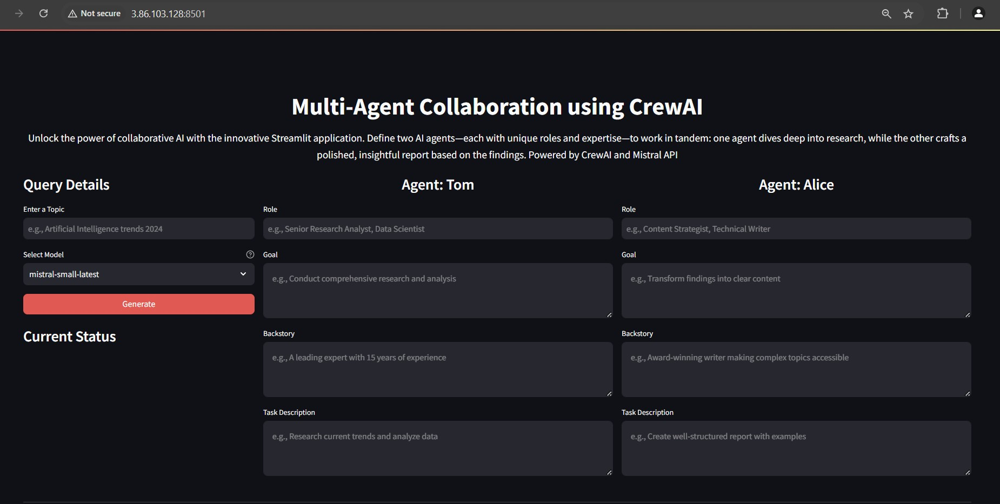
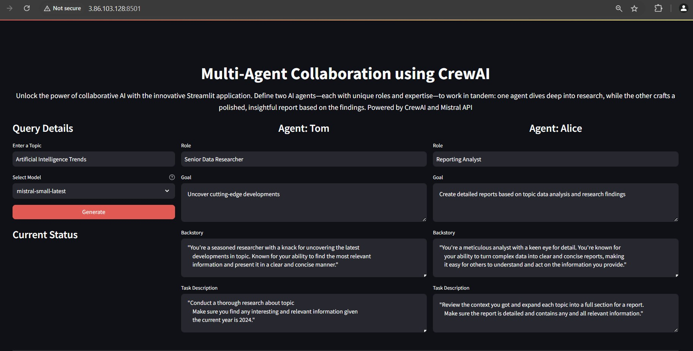
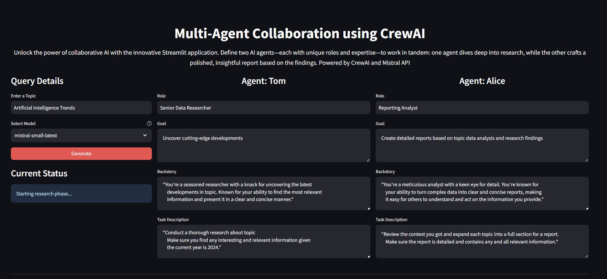
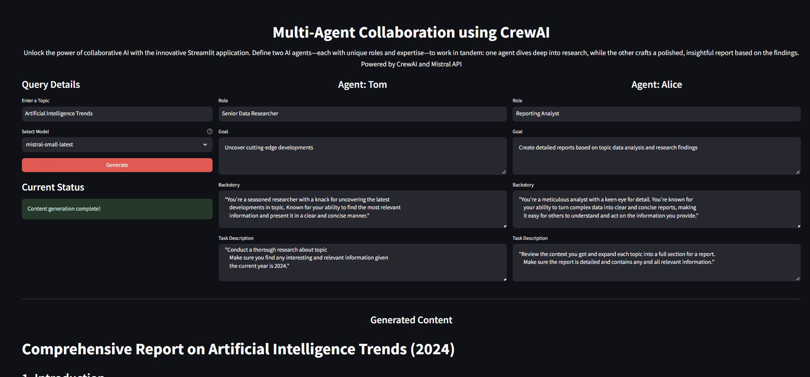

# Multi-Agent Collaboration using CrewAI

Unlock the power of collaborative AI with the innovative Streamlit application. Define two AI agents—each with unique roles and expertise—to work in tandem: one agent dives deep into research, while the other crafts a polished, insightful report based on the findings. Powered by CrewAI and Mistral API

## Key Features
- **Topic**: User defines Topic 
- **Agents**: User defines Agents Role, Goal, Backstory and Task Description

## Installation and Setup

1. Install Python 3.10 or above
2. Clone the repository
3. Install dependencies:
  `pip install -r requirements.txt`
4. Set up environment variables: Create a .env file and populate it with Mistral API Key
```
MISTRAL_API_KEY = "<YOUR_MISTRAL_API_KEY>"  # Replace with your Mistral API key
```
## Usage

1. Run the application;
`streamlit run app.py`

2. Open the application in your browser

## How it Works:

1. Input a Topic and choose a Model 
2. Define Agents Role, Goal, Backstory and Task Description
3. Click Generate and see the response

## Important Notices

- **Cost Awareness**: Be mindful of resources, Mistral APIs, and other resources consumption and costs before deployment
- **Development Purpose**: Not intended for production or commercial use
- **Security**: Never commit credentials to version control and follow AWS security best practices


## The webpage will appear as shown below. 


### 1. Streamlit web app initial screen


### 2. Example Filled in Topic and Agents Role, Goal, Backstory, and Task Descrition 



### 3. Current Active Status after clicking Generate. Status will keep changing based on current state till report generated. 



### 4. Report Generated



