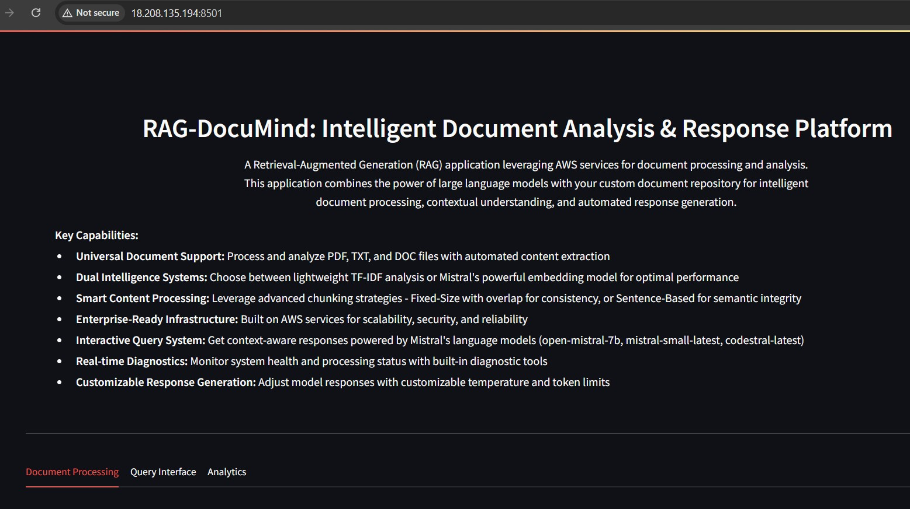

# RAG-DocuMind: Intelligent Document Analysis & Response Platform

DocuMind is a Retrieval-Augmented Generation (RAG) application that combines the power of large language models with a custom document repository. It leverages AWS services for document processing, contextual understanding, and intelligent response generation.

## Key Features
- **Universal Document Support**: Process and analyze PDF, TXT, and DOC/DOCX files with automated content extraction.
- **Dual Intelligence Systems**:
  - Lightweight **TF-IDF** vectorization.
  - **Mistral's embedding model** for advanced contextual understanding.
- **Smart Content Processing**: Choose between:
  - Fixed-size chunking with overlap.
  - Sentence-based chunking for semantic integrity.
- **Enterprise-Ready Infrastructure**: Scalable, secure, and reliable, built on AWS services.
- **Interactive Query System**: Context-aware query responses using Mistral models like `open-mistral-7b` and `mistral-small-latest`.
- **Real-time Diagnostics**: Built-in tools to monitor system health and processing status.
- **Customizable Response Generation**: Fine-tune model responses with adjustable temperature and token limits.

## Installation and Setup

1. Create AWS S3 bucket, IAM Role, Postgres database, EC2 instance and Install Python. Mistral API credentials.
2. Clone the repository
3. Install dependencies:
  `pip install -r requirements.txt`
4. Set up environment variables: Create a .env file and populate it with your AWS, PostgreSQL, and Mistral API credentials:
```
S3_BUCKET_NAME = "yourBucketName"  # Replace with your actual S3 bucket name
S3_DOCUMENT_KEY = ""
AWS_ACCESS_KEY_ID = "<YOUR_ACCESS_KEY_ID>"  # Replace with your AWS access key ID
AWS_SECRET_ACCESS_KEY = "<YOUR_SECRET_ACCESS_KEY>"  # Replace with your AWS secret access key
AWS_REGION = "us-east-1"

# Database configuration (replace with your database details)
POSTGRES_HOST = "your_postgres_host" ex:database-1.bsgfkdhd.us-east-1.rds.amazonaws.com
POSTGRES_PORT = 5432
POSTGRES_DB = "your_database_name"
POSTGRES_USER = "your_database_user"
POSTGRES_PASSWORD = "your_database_password"

MISTRAL_API_KEY = "<YOUR_MISTRAL_API_KEY>"  # Replace with your Mistral API key
```
## Usage

1. Run the application;
`streamlit run app.py`

2. Open the application in your browser

## How it Works:

### Document Processing
1. Upload PDF, TXT, or DOC files to AWS S3
2. Choose Vectorizer or Embed Model 
3. Choose Chunking Strategy(Fixed-Size or Sentence-Based) and click Embed
4. Run Diagnostics (optional)
5. Choose a Model and set temperature and max tokens 

### Query Interface
1. Enter a prompt in natural language and click submit
2. Retrieve relevant document chunks
3. Generate context-aware responses using Mistral models.

### Analytics 
1. Visualize Document embeddings
2. Track recent queries and responses.


## The webpage will appear as shown below. 


### 1. Streamlit web app initial screen


### 2. Document Processing Screen 


### 3. Document Embedded 


### 4. Run Diagnostics 


### 5. Generation settings 


### 6. Query Inteface  


### 7. Query Interface showing Final Response


### 8. Analytics


